# Backtest results

**1️⃣ - On the fourth tab, “Backtest results” you can analyze the different metrics of your strategy :**

<figure><figcaption></figcaption></figure>

**2️⃣ - Easily compare your strategies with the main cryptoassets :**

<figure><figcaption></figcaption></figure>

## Global information

Here you see the information relating to the strategy that you have just backtested. So these are all the settings you defined during the configuration step.

<figure><figcaption></figcaption></figure>

## Performance

Here you can see the final performance of the strategy you just backtested.

<figure><figcaption></figcaption></figure>

## Returns

**Adjusted returns** by the **risk-free rate** is a measure that takes into account the risk-free interest rate in the calculation of the returns of a portfolio or a financial asset. The risk-free rate represents the return that can be obtained without taking any risk, for example, by investing in government bonds.

The **average return** of a trading strategy or portfolio is a statistical measure that indicates the average return one can expect to achieve over a given period of time, typically measured in percentage. This measure is important for investors as it enables them to determine whether a trading strategy or portfolio has generated a positive or negative return over time.

<figure><figcaption></figcaption></figure>


[🔗 Learn more about Adjusted Returns](../risk-management/risk-measures/adjusted-returns.md)

[🔗 Learn more about Average Returns](../risk-management/risk-measures/average-returns.md)


## Ratios

Ratios such as the Sharpe Ratio, Calmar Ratio, Treynor Ratio, and Sortino Ratio are crucial for evaluating the performance of an investment while taking into account the risk associated with that investment. These ratios enable investors to compare different investment options and strategies, taking into account various aspects of risk and return.

<figure><figcaption></figcaption></figure>


[🔗 Learn more about Ratios](../risk-management/ratios/)


## Volatility

Volatility is a measure of the variability of a financial asset's returns over time. It measures the magnitude of price fluctuations of a financial asset and thus indicates the amount of risk associated with that asset.

Investors who are willing to take risks may prefer more volatile financial assets because they generally offer higher returns, but they also carry a higher risk of significant losses. Investors who seek to minimize their risk may prefer less volatile financial assets, which offer lower but more stable returns.

Risk measurement in trading is a method used to assess the level of risk in a trading position or portfolio. There are several methods for measuring risk, which differ in terms of complexity and accuracy.

<figure><figcaption></figcaption></figure>


[🔗 Learn more about Risk Measures](../risk-management/risk-measures/)


## Value at Risk

**Value at Risk (VaR)** is defined as the potential financial loss amount within a specific enterprise, portfolio or position over a given **time period** with a certain **confidence interval**. Risk managers use VaR to understand and control the level of risk exposure of a specific position or entire portfolio and use it to measure the overall risk exposure of an asset.

<figure><figcaption></figcaption></figure>


[🔗 Learn more about Value at Risk](../risk-management/value-at-risk/)


## Portfolio Performance&#x20;

Performance of the portfolio in relation to the assets that compose it. You can see the individual performance of each asset against the portfolio.

<figure>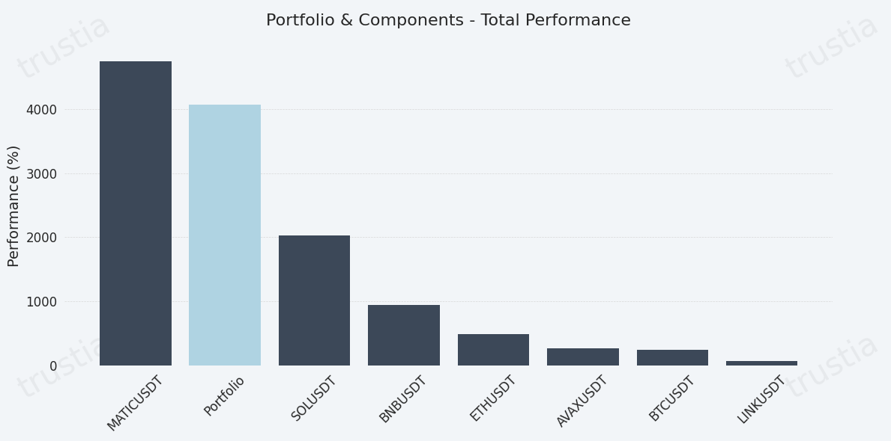<figcaption></figcaption></figure>

<figure>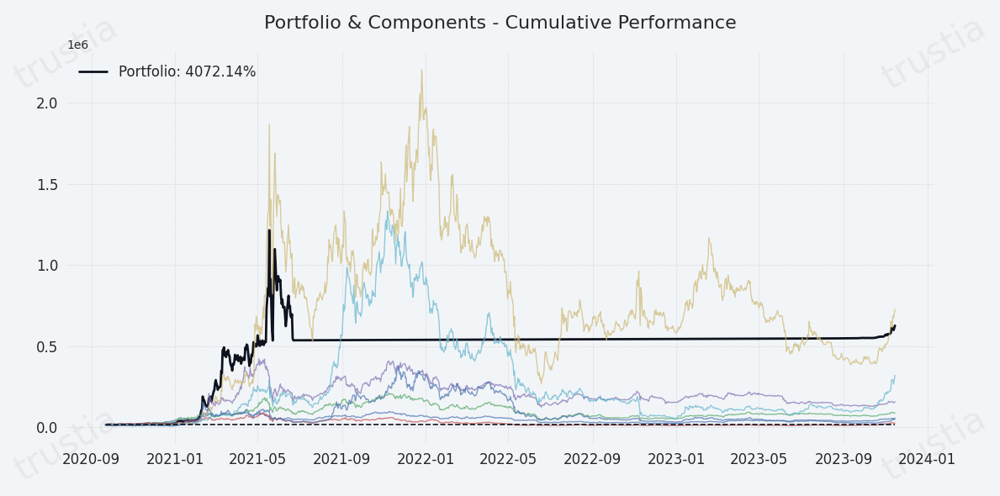<figcaption></figcaption></figure>

## Drawdown

In finance, drawdown is a measure of the maximum loss suffered by an investment relative to its all-time high (ATH) point. In other words, it is the maximum drop in the price of the portfolio compared to its highest level reached.

<figure>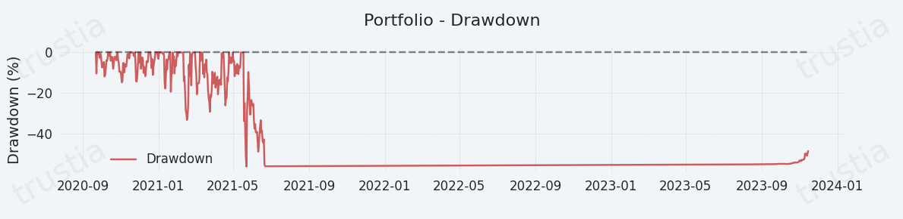<figcaption></figcaption></figure>


[🔗 Learn more about Drawdown ](../risk-management/risk-measures/maximum-drawdown.md)


## Historical Portfolio Weighting

Here you can see the history of portfolio rebalancing. Refer to the color associated with the symbol of each asset, to understand and visualize the different periods of the chart.

<figure>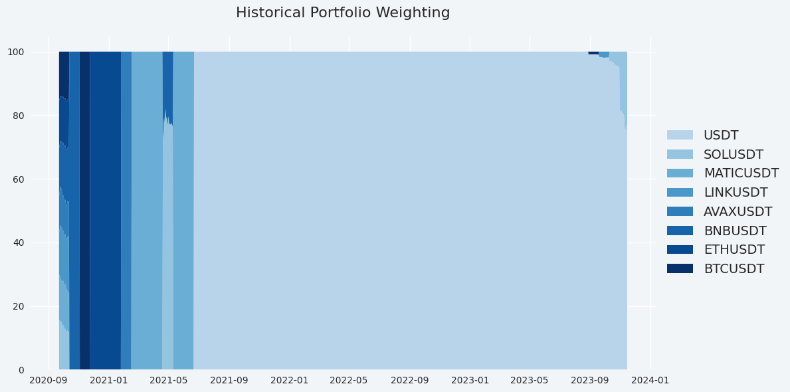<figcaption></figcaption></figure>

## Current Assets Weighting

Current asset allocation in your portfolio. Refer to the color associated with the symbol of each asset, to understand and visualize the different periods of the chart.

<figure>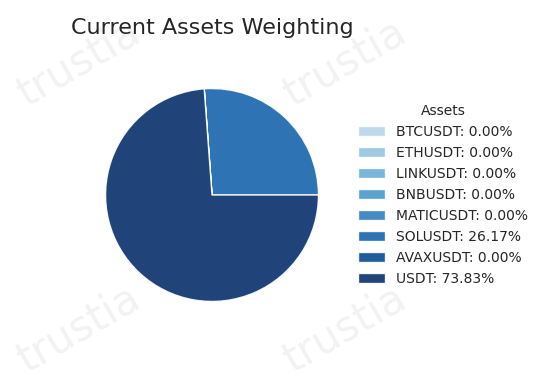<figcaption></figcaption></figure>

## Portfolio vs Components

The efficient frontier comprises investment portfolios that offer the highest expected return for a specific level of risk. The red dot represents your portfolio while the blue dots individually represent the assets included in your portfolio.

<figure>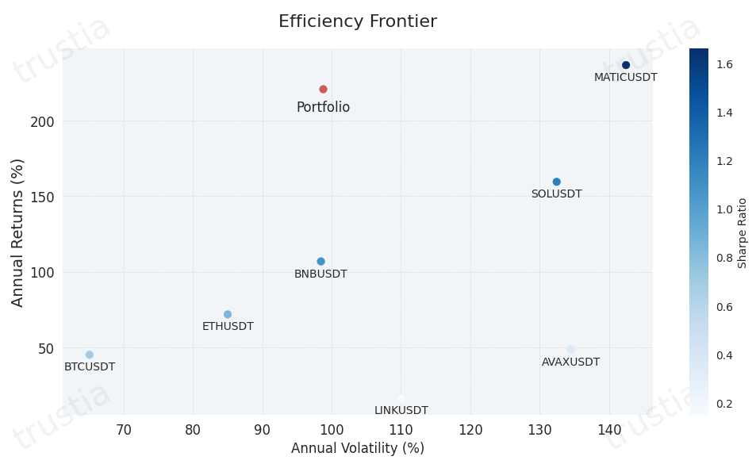<figcaption></figcaption></figure>

## Ratios Analysis&#x20;

Ratios such as the Sharpe Ratio, Calmar Ratio, Treynor Ratio, and Sortino Ratio are crucial for evaluating the performance of an investment while taking into account the risk associated with that investment. These ratios enable investors to compare different investment options and strategies, taking into account various aspects of risk and return.

<figure>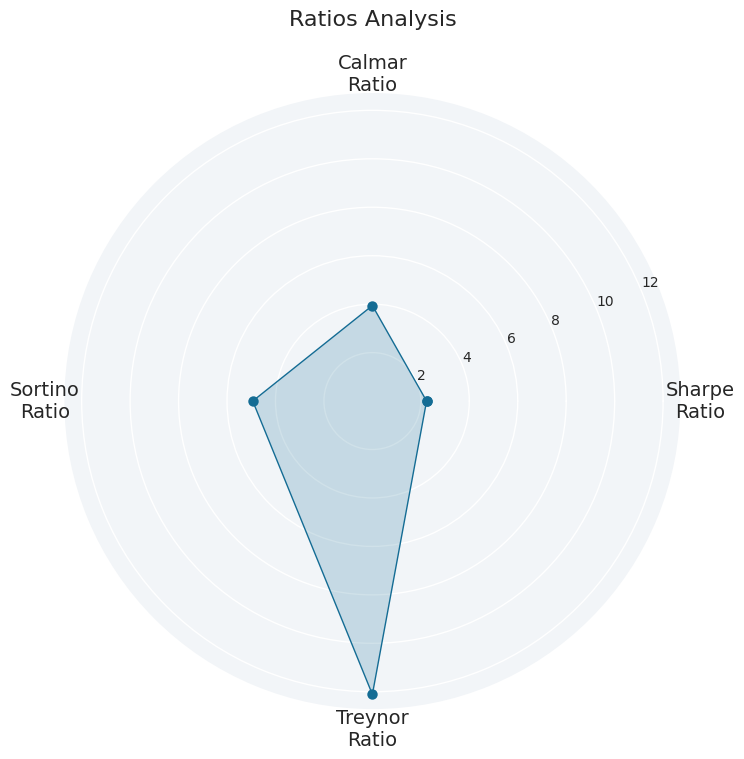<figcaption></figcaption></figure>


[🔗 Learn more about ratios](../risk-management/ratios/)


## Efficiency Frontier

The efficient frontier comprises investment portfolios that offer the highest expected return for a specific level of risk. It represents graphically portfolios that maximize returns for the risk assumed, showing the benefit of diversification. To use the efficient frontier, a risk-seeking investor selects investments that fall on the right side of the frontier. Meanwhile, a more conservative investor would pick investments that lie on the left side of the frontier.

The red dot represents your portfolio while the blue dots represent simulated portfolios.

<figure>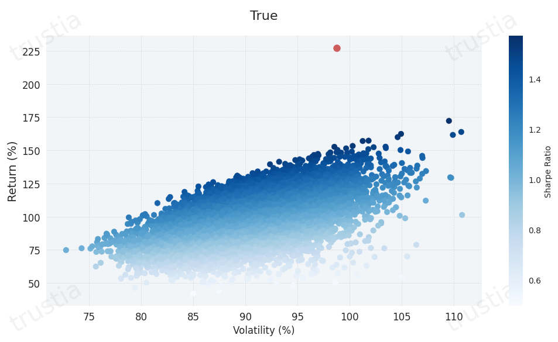<figcaption></figcaption></figure>

## Historical Volatility&#x20;

Volatility often refers to the degree of uncertainty or risk associated with the magnitude of changes in the value of an asset. Higher volatility means that an asset's value can potentially spread over a wider range of values. This means that the price of the asset can change significantly over a short period of time in either direction. Lower volatility means that a security's value does not fluctuate dramatically and tends to be more stable.

Historical volatility is based on historical prices and represents the degree of variability in the returns of an asset. This number is without a unit and is expressed as a percentage.

<figure>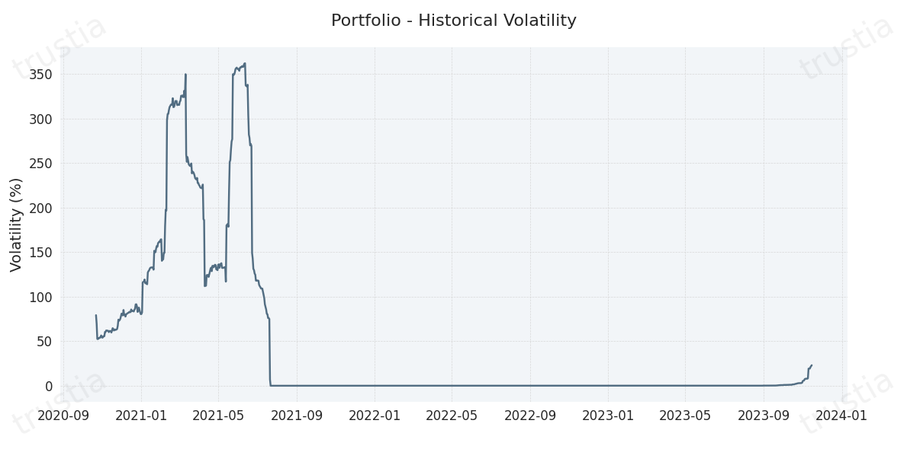<figcaption></figcaption></figure>


[🔗 Learn more about Volatility](../risk-management/risk-measures/volatility.md)


## Value at Risk

Value at Risk (VaR) is defined as the potential financial loss amount within a specific enterprise, portfolio or position over a given time period with a certain confidence interval. Risk managers use VaR to understand and control the level of risk exposure of a specific position or entire portfolio and use it to measure the overall risk exposure of an asset.

There are several methods for calculating VaR, ranging from simple methods based on historical statistics, parametric methods such as variance-covariance, to more sophisticated methods that use complex mathematical models such as Monte Carlo simulation.

<figure>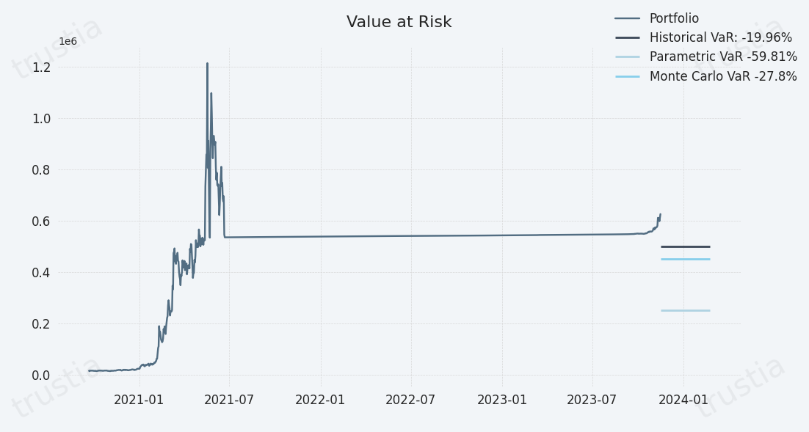<figcaption></figcaption></figure>


[🔗 Learn more about Value at Risk](../risk-management/value-at-risk/)


## Covariance Matrix

In the construction of a portfolio, it is important to attempt to reduce overall risk by including assets that have a negative covariance with each other. Analysts use historical price data to determine the measure of covariance between different stocks. This assumes that the same statistical relationship between the asset prices will continue into the future, which is not always the case. By including assets that show a negative covariance, the risk of a portfolio is minimized. Covariance provides a statistical measurement of the risk for a mix of assets.

A positive covariance means that assets generally move in the same direction. Negative covariance means assets generally move in opposite directions.

<figure>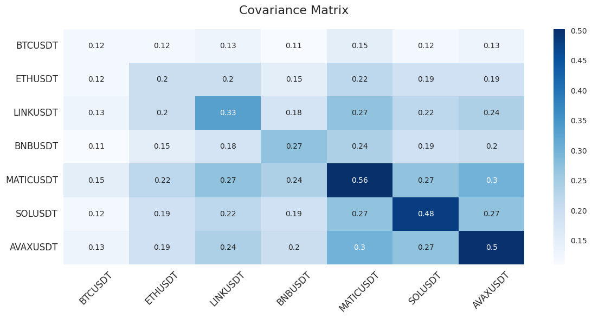<figcaption></figcaption></figure>

## Correlation Matrix

Correlation statistically measures the degree of relationship between two variables in terms of a number between +100 and -100. When it comes to diversified portfolios, correlation represents the degree of relationship between the price movements of different assets included in the portfolio. A correlation of +100 means that prices move in tandem; a correlation of -100 means prices are moving in opposite directions. A correlation of 0 means that asset price movements are uncorrelated; in other words, the change in the price of one asset has no effect on the change in the price of the other asset.

<figure>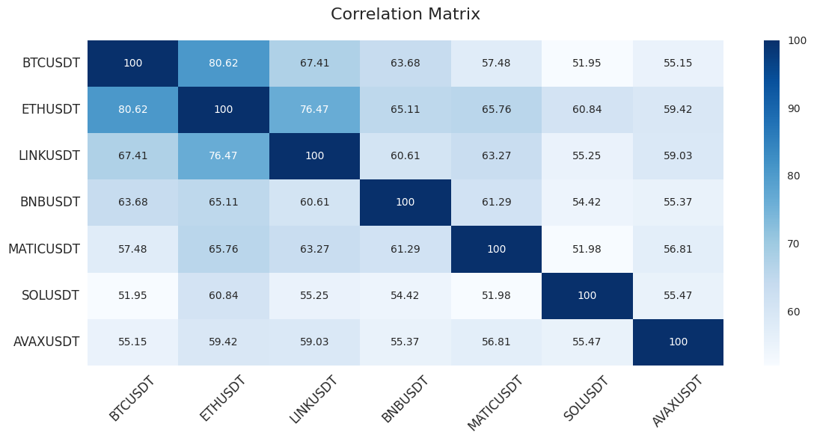<figcaption></figcaption></figure>
