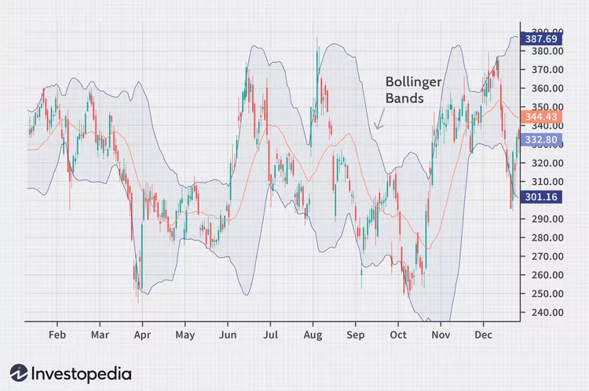

# Bollinger Bands



Bollinger Bands are a technical indicator created by John Bollinger. They are used to measure the volatility of a financial asset by plotting two bands around a moving average.

Bollinger Bands are calculated by taking a moving average over a given period of time, and drawing two lines a certain distance away from that moving average. The distance between the two lines is determined by the standard deviation of the data series used to calculate the moving average.

<figure><figcaption></figcaption></figure>

Bollinger Bands are often used to identify support and resistance levels, as well as to detect overbought or oversold conditions in the market. When the price of a financial asset reaches the upper Bollinger Band, this may indicate that the asset is overbought and a correction to the downside is likely. Similarly, when the price reaches the lower Bollinger Band, this may indicate that the asset is oversold and a correction to the upside is likely.

**Calculation of moving average :**&#x20;

$$
\text{Moving Average} = \frac{1}{N} \sum _{i=1} ^{N} {x_i}
$$

**Calculation of standard deviation :**

$$
\text{Standard Deviation} = \sqrt{\frac{\sum _{i=1} ^{N} {(x_i - \bar{x})^2}}{N-1}}
$$


_N_ = moving average rolling period

_xi_ = yield at time i

_x\__ = average of returns over the given time interval (_N_)


More info : [_Investopedia_](https://www.investopedia.com/terms/b/bollingerbands.asp)
