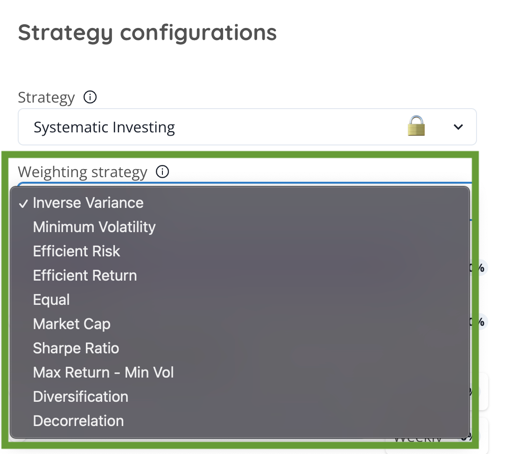

# Moving Average Convergence/Divergence (MACD)



The Moving Average Convergence Divergence (MACD) is an indicator created by Gerald Appel. It is often used to determine the direction and strength of a trend in the market.

The MACD consists of 2 exponential moving averages (EMA): a shorter one, typically of 12 periods, and a longer one, typically of 26 periods. These two moving averages are subtracted from each other to create a signal line, which is a 9-period EMA.

The MACD is considered bullish when the MACD line crosses above the signal line, indicating an increase in bullish momentum. Conversely, the MACD is considered bearish when the MACD line crosses below the signal line, indicating an increase in bearish momentum.

The MACD can also be used to detect divergences between the price of a financial asset and the indicator itself, which can indicate a potential trend reversal.

### Learning from MACD 

MACD has a positive value (shown as the blue line in the lower chart) whenever the 12-period EMA (indicated by the red line on the price chart) is above the 26-period EMA (the blue line in the price chart) and a negative value when the 12-period EMA is below the 26-period EMA. The level of distance that MACD is above or below its baseline indicates that the distance between the two EMAs is growing.

In the following chart, you can see how the two EMAs applied to the price chart correspond to the MACD (blue) crossing above or below its baseline (red dashed) in the indicator below the price chart.

<figure><figcaption></figcaption></figure>

MACD is often displayed with a histogram (see the chart below) that graphs the distance between MACD and its signal line. If MACD is above the signal line, the histogram will be above the MACD’s baseline, or zero line. If MACD is below its signal line, the histogram will be below the MACD’s baseline. Traders use the MACD’s histogram to identify when bullish or bearish momentum is high and possibly overbought/oversold.

<figure><figcaption></figcaption></figure>

More info : [_Investopedia_](https://www.investopedia.com/terms/m/macd.asp)
