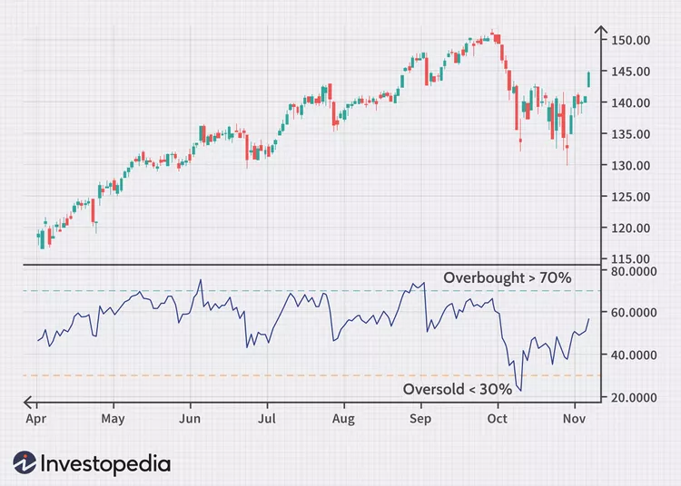

# Relative Strength Index (RSI)

Is used in technical analysis to measure the strength or weakness of a financial asset by comparing recent gains and losses. It is used to determine whether a financial asset is overbought (overvalued) or oversold (undervalued).

The RSI ranges from 0 to 100. An RSI above 70 usually indicates that the asset is overbought, which means it is likely to experience a downward correction. An RSI below 30 usually indicates that the asset is oversold, which means it is likely to experience an upward correction.

After the RSI is calculated, the RSI indicator can be plotted beneath an asset’s price chart, as shown below. The RSI will rise as the number and size of up days increase. It will fall as the number and size of down days increase.

<figure><figcaption></figcaption></figure>

**Formula for the RSI :**

$$
RSI = 100 - \frac {100}{1 + \frac{moyenne_{hausse}}{moyenne_{baisse}}}
$$

Note that this simplistic strategy does not allow one to outperform the market.

More info : [_Investopedia_](https://www.investopedia.com/terms/r/rsi.asp)
