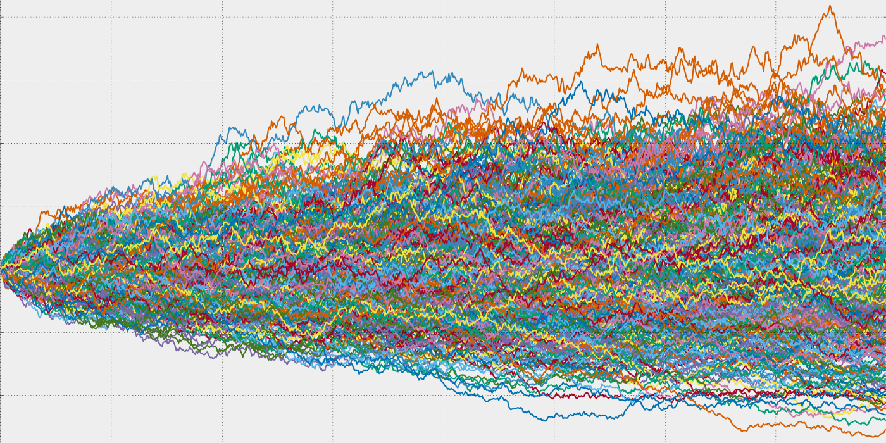

# Monte Carlo VaR

The **Monte Carlo VaR** is a method of calculating VaR that is based on a **stochastic simulation** of the returns of a portfolio or asset. It allows for the consideration of non-normal return distributions and market stress scenarios.

To calculate VaR Monte Carlo, we start by specifying a mathematical model that describes the dynamics of the asset or portfolio prices, using random variables to model uncertainties. We then simulate a large number of possible price trajectories using simulation techniques.

Next, for each simulated trajectory, we calculate the corresponding loss for a certain level of confidence. Finally, we calculate the VaR by choosing the maximum loss observed in a certain percentage of simulated trajectories, such as the 1% worst case scenarios.

VaR Monte Carlo is often considered the most accurate method for calculating VaR, as it allows for the consideration of non-normal distributions and risks related to extreme events. However, it can be more complex to implement and requires detailed historical data to estimate the model parameters.

<figure><figcaption></figcaption></figure>


[monte-carlo-simulations.md](../backtesting-strategies/monte-carlo-simulations.md)


More info : [_Investopedia_](https://www.investopedia.com/terms/m/montecarlosimulation.asp)
