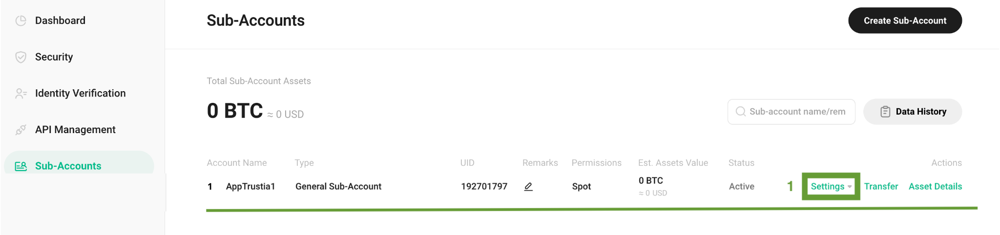

# Kucoin Connect

Important note

1. Since July 15 2023, users [need to pass KYC](https://www.kucoin.com/fr/announcement/enhancement-of-kucoin-customer-identification-and-verification-program) in order to use all services.
2. You must enable security verifications to add API keys.&#x20;
3. You must transfer funds to your Sub-Account to launch a strategy.

### **1️⃣ - Go to Kucoin**

Log in or create a new account at [https://www.kucoin.com/](https://www.kucoin.com/ucenter/signup?rcode=r352QTN).

### 2️⃣ - Follow to the API page 

Hover over the **profile icon** on the top right corner, then click **Sub-Account** :&#x20;

<figure><figcaption></figcaption></figure>

### 3️⃣ - Create Sub-Account 

Click on Create Sub-Account :&#x20;

<figure><figcaption></figcaption></figure>

### 4️⃣ - Sub-Account Configuration

1. Choose the **name** of your Sub-Account&#x20;
2. Activity **only SPOT** permission&#x20;
3. Set a **password** for your Sub-Account&#x20;
4. Select **General Sub-Account**
5. Click on **Save**

<figure><figcaption></figcaption></figure>

### 5️⃣ - Security Verification 

Enter all needed verification codes and click Confirm :&#x20;

<figure><figcaption></figcaption></figure>

### 6️⃣ - Create API

You are then redirected to the general Sub-Account page.&#x20;

1. Click on **Settings** on the subaccount you just created
2. Then click **View API**.

<figure><figcaption></figcaption></figure>

<figure><figcaption></figcaption></figure>

3. Click on **Create API**

<figure><figcaption></figcaption></figure>

### 7️⃣ - API Configuration

1. Select **API-based Trading**&#x20;
2. Choose a name for your API&#x20;
3. Define a **Passphrase** for your API. (**you will need this to complete the setup**)&#x20;
4. In API restrictions checked only **General** and **SPOT Trading**&#x20;
5. In IP restrictions checked **No**&#x20;
6. Then click **Next**

<figure><figcaption></figcaption></figure>

<figure><figcaption></figcaption></figure>

### 8️⃣ - Security Verification 

Enter all needed verification codes and click Confirm :&#x20;

<figure><figcaption></figcaption></figure>

### 9️⃣ - You have created your API keys 

1. Then copy the **API key** and **Secret**
2. Click on **Confirm**

<figure><figcaption></figcaption></figure>

You then see the API which is linked to your Sub-Account :

<figure><figcaption></figcaption></figure>

### 1️⃣0️⃣ - Connect your API to the Trustia application

Login to the Trustia application and go to the API Key section

1. Select **Kucoin** as your exchange platform&#x20;
2. Choose a **name** for your API&#x20;
3. Pasted your **API Key** (9️⃣)
4. Pasted your **API Passphrase** (The one you added in section 7️⃣ and in the third point)&#x20;
5. Pasted your **Secret** (9️⃣)

<figure><figcaption></figcaption></figure>

### 1️⃣1️⃣ - Add funds to your Sub-Account

Return to Kukoin on the general Sub-Account page

1. Click on **Transfer** :&#x20;

<figure><figcaption></figcaption></figure>

### 1️⃣2️⃣ - Master Account transfer to Sub-Account

1. Choose your **Master Account** with which you wish **to fund your Sub-Account**
2. Then select **Sub-Account-Trading Account.** (Be careful to select the right one)
3. Then select **USDT** to fund your Sub-Account. (We do not support other stablecoins)
4. Select the **amount in USDT** you want to send to your Sub-Account
5. Click on confirm

<figure><figcaption></figcaption></figure>

### 1️⃣3️⃣ - Check that the funds are in the correct Sub-Account

Then, to **verify that your transfer** has arrived on Sub-Account-Trading Account, click on **Asset Details** :&#x20;

<figure><figcaption></figcaption></figure>

<figure><figcaption></figcaption></figure>
