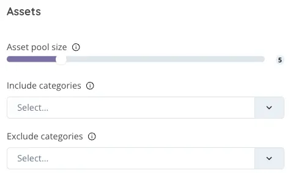

# AI Asset Selector

<figure><figcaption></figcaption></figure>

## **Configuring the AI Asset Selector for Tailored Investment Choices**

On our platform, you have the unique opportunity to harness the power of our AI Asset Selector, a cutting-edge tool designed to simplify your investment process. This intelligent feature automatically selects a pool of assets that aligns perfectly with your specific category preferences, ensuring your portfolio is customized to your investment goals and interests.

### **How to Utilize the AI Asset Selector**

**Specify Your Preferences:** Begin by defining your categories of interest. Whether you're focused on technology, renewable energy, healthcare, or any other sector, our AI Asset Selector uses these preferences as a guide to curate a relevant and diversified asset pool.

**Benefits of Using the AI Asset Selector:**

* **Efficiency:** Save time and effort in asset selection, as the AI handles the heavy lifting of identifying potential investment opportunities based on your preferences.
* **Customization:** Achieve a high level of personalization in your portfolio by guiding the AI with your specific investment categories, tailoring your asset pool to your unique goals.
* **Diversification:** Benefit from a diversified portfolio that spans various sectors and asset types, enhancing your potential for balanced growth and minimizing risk exposure.

Embrace the future of investment strategy configuration by leveraging our AI Asset Selector. This tool empowers you to efficiently curate a portfolio that not only meets but exceeds your investment expectations, all with a level of customization and insight previously unattainable. Get ready to transform your approach to asset selection and portfolio management with this advanced, intuitive technology.

<figure><figcaption></figcaption></figure>


