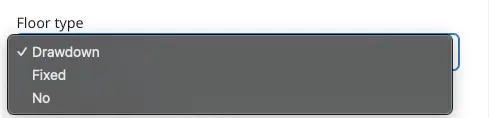

# Enable Capital Protection

<figure><figcaption></figcaption></figure>

## **Configuring Your CPPI Strategy for Optimal Protection**

The Constant Proportion Portfolio Insurance (CPPI) configuration plays a pivotal role in tailoring your investment strategy to match your risk tolerance and protection needs. CPPI offers several configurations to ensure your capital is safeguarded while allowing for potential growth. Here's how to choose the right CPPI floor type based on your investment strategy:

### Floor Configuration

**Drawdown Approach:** The floor value is set as a predefined percentage of the portfolio's maximum value, which is considered 100%. Should the portfolio's asset value increase, this maximum becomes the new benchmark for the predefined floor value, ensuring the floor value adjusts upward with portfolio growth.

#### Fixed Floor Configuration

**Fixed Approach:** Here, the floor value is anchored to the initial investment value minus the cushion value. This means the initial investment's value always represents 100% of the floor value, maintaining constant protection levels even if the portfolio's maximum value increases.

### Disabling CPPI

**No CPPI:** For investors who prefer not to use CPPI, this option entirely disables the mechanism, removing the protective floor and allowing the portfolio to operate without the specific safeguards CPPI provides.

### Making Your CPPI Selection

Choosing the right CPPI configuration is crucial for aligning your portfolio with your financial goals and risk management strategy. Whether you're looking for an adaptable protection level that grows with your portfolio (Drawdown), a stable protection based on your initial investment (Fixed), or prefer to manage your investment without CPPI (No CPPI), your choice will define how your capital is protected and how your portfolio can respond to market dynamics.

**To activate CPPI** in your portfolio, simply select the floor type that best suits your investment approach. **If CPPI is not part of your strategy,** selecting 'No' will bypass this feature, offering you the flexibility to manage your portfolio according to your specific investment preferences.

By carefully configuring your CPPI strategy, you ensure that your investments are not only geared towards maximizing returns but are also protected against downside risks, providing a balanced approach to achieving your long-term financial objectives.

<figure><figcaption></figcaption></figure>


