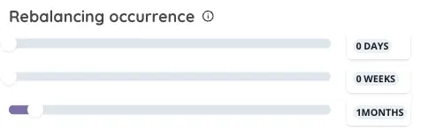

# Ocurence rebalancement Selection

<figure><figcaption></figcaption></figure>

## Rebalancing occurrence

### **Optimizing Portfolio Performance through Strategic Rebalancing**

Rebalancing is a critical process in portfolio management, ensuring that your investment allocations remain aligned with your risk tolerance and return objectives over time. As market dynamics shift and asset values fluctuate, rebalancing helps in readjusting the portfolio to maintain its original, desired asset allocation.

### **Understanding Rebalancing Occurrence**

The rebalancing occurrence is pivotal, defining the intervals at which your portfolio undergoes reallocation to adhere to its targeted asset distribution. This temporal setting is crucial for two main reasons:

1. **Minimizing Transaction Costs:** Opting for too frequent rebalancing can lead to increased transaction fees on your chosen exchange platform, which could detract from your strategy's overall performance.
2. **Preserving Strategy Integrity:** Conversely, infrequent rebalancing may cause your portfolio to drift too far from its intended allocation, potentially exposing you to higher risk or missed opportunities for reward.

### **Choosing Your Rebalancing Frequency**

When setting the rebalancing frequency, consider the following options to find the balance that best suits your strategy:

* **Daily (x days):** Suitable for highly dynamic strategies with a focus on short-term market movements.
* **Weekly (x weeks):** Offers a balanced approach, allowing for adjustments to short-term fluctuations without incurring excessive costs.
* **Monthly (x months):** Ideal for long-term investment strategies, minimizing transaction fees while ensuring the portfolio stays aligned with strategic goals.

### **Example of Rebalancing Temporality**

Determining the temporality of each rebalancing involves assessing your investment approach, market volatility, and the impact of potential transaction costs. For instance, a monthly rebalancing might be chosen for a diversified, long-term portfolio to balance the need for strategic alignment with cost efficiency.

In conclusion, selecting the appropriate rebalancing frequency is essential in maintaining your portfolio's health and achieving your investment objectives. By carefully considering your strategy's requirements and the implications of rebalancing intervals, you can optimize your portfolio's performance while managing costs and adhering to your desired level of risk and reward.

<figure><figcaption></figcaption></figure>


