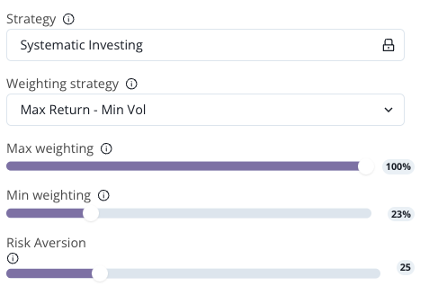

# Weighting Selection

<figure><figcaption></figcaption></figure>

## **Mastering Portfolio Rebalancing: Aligning Risk and Return with Investment Goals**

As the market ebbs and flows, the value of a portfolio's assets will inevitably shift, potentially skewing the portfolio towards a risk and return profile that may not align with an investor's initial goals and risk preferences. This drift occurs as assets that appreciate in value come to represent a larger portion of the portfolio, while those that depreciate occupy a smaller share. Without periodic rebalancing, a portfolio might inadvertently shift towards higher risk and potentially higher return assets.

### **Utilizing Statistical Algorithms for Personalized Weighting Strategies**

Our advanced statistical algorithms are designed to devise a weighting strategy that is not only efficient but also customized to match your specific investment objectives, risk tolerance, and market outlook. Whether you're inclined towards aggressive growth with a high tolerance for volatility, or you prefer a more conservative approach, these algorithms adjust your portfolio's asset allocation to suit your unique investment profile.

**Configuring Your Portfolio for Optimal Balance**

This panel provides the tools to:

* **Select the Weighting Strategy:** Choose a strategy that aligns with your investment objectives and risk profile.
* **Set Maximum and Minimum Weighting Percentages:** Define the bounds for each asset's representation in your portfolio to maintain desired diversification.
* **Incorporate Additional Parameters for Certain Strategies:** Some strategies may require further customization to fine-tune your portfolio's alignment with your goals.

In conclusion, portfolio rebalancing is a critical process for maintaining the alignment of your investment strategy with your financial objectives and risk preferences. Through strategic asset reallocation, rebalancing ensures that your portfolio remains optimally configured over time, safeguarding against unintended risk exposure and capitalizing on market opportunities to buy low and sell high.

<figure><figcaption></figcaption></figure>


