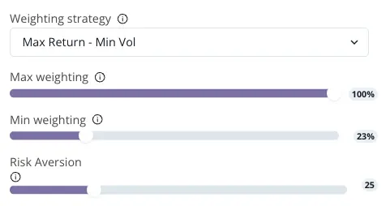
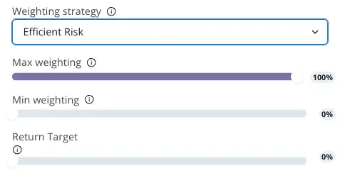
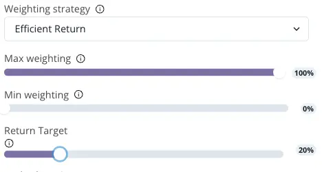

# Additional Parameters selection

<figure><figcaption>
Example with Max Return - Min Vol
</figcaption></figure>

### Additional parameters


Additional parameters are only available for the strategies: Max Return / Min Volatility, Efficient Risk and Efficient Return strategies


**Fine-Tuning Your Strategy with Additional Parameters**

For investors adopting the Max Return / Min Volatility, Efficient Risk, and Efficient Return strategies, additional parameters play a vital role in aligning your portfolio with your specific risk preferences and return objectives. These parameters are essential in customizing these strategies to your individual investment profile.

* [**Max Return / Min Volatility**](../../../algorithms-models/maximum-return-minimum-volatility.md)&#x20;
  * In the Max Return / Min Volatility strategy, your risk aversion is a crucial factor. This is represented by a parameter ranging from 1 to 100.
  * A higher value indicates a greater aversion to risk, prompting the strategy to lean towards minimizing volatility.
  * Conversely, a lower value suggests a lower risk aversion, allowing for a strategy that pursues higher returns despite the associated risks.

* [**Efficient Risk**](../../../algorithms-models/efficient-risk.md) **&** [**Efficient Return**](../../../algorithms-models/efficient-return.md)&#x20;
  * For both the Efficient Risk and Efficient Return strategies, the target return plays a pivotal role.
  * This target is calculated based on the capital invested in your portfolio plus the desired profit.
  * The additional parameter here is the percentage of your target return on the portfolio, guiding the strategy towards achieving your specified financial goals.

<figure><figcaption>
Example with Efficient Risk
</figcaption></figure>

<figure><figcaption>
Example with Efficiency Return
</figcaption></figure>

**Implementing Your Strategy Adjustments**

* **Max Return / Min Volatility:** Clearly indicate your level of risk aversion to ensure the strategy aligns with your comfort level in handling market fluctuations.
* **Efficient Risk & Efficient Return:** Define your target return as a percentage, providing a clear goal for the portfolio's performance.

By fine-tuning these additional parameters, you gain greater control over your investment strategy, ensuring it accurately reflects your risk tolerance and return expectations. These settings are key in developing a portfolio that not only strives to meet your financial objectives but also aligns with your personal approach to risk and return management. With these adjustments, your portfolio is better equipped to navigate the complexities of the financial markets, tailored to your unique investment profile.

<figure><figcaption></figcaption></figure>


