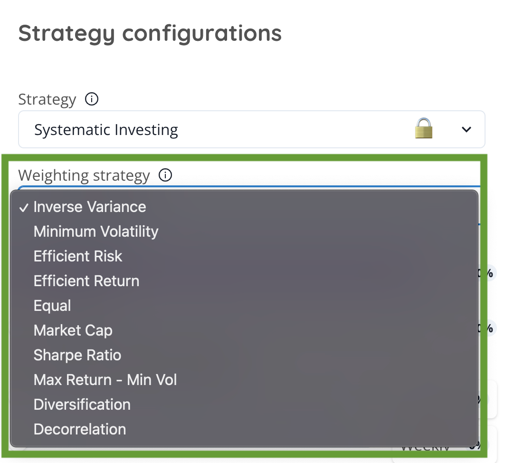

# Strategy Selection

## **Choosing Your Optimal Strategy Model**

<figure><figcaption></figcaption></figure>

Embark on your investment journey with a crucial first step: selecting the strategy model that perfectly aligns with your financial goals, your appetite for risk, and the duration of your investment horizon. This foundational choice sets the tone for your portfolio's structure and potential success, ensuring that the strategies you employ resonate with your personal investment philosophy and long-term objectives.

**Understanding Your Investment Blueprint**

* **Identify Your Objectives:** Clarify what you aim to achieve with your investments, whether it's wealth accumulation, income generation, or capital preservation.
* **Assess Your Risk Tolerance:** Gauge how much risk you are willing and able to accept in pursuit of your investment goals. This will influence the aggressiveness or conservatism of your chosen strategy.
* **Define Your Time Horizon:** Consider the length of time you plan to invest, as this will affect your strategy's focus on growth, stability, or liquidity.

### **Selecting the Strategy Model**

Once you have a clear understanding of your investment blueprint, it's time to choose a strategy model that caters to these parameters. Whether you're drawn to aggressive growth strategies, prefer a balanced approach, or lean towards conservative investment models, the right strategy will be pivotal in navigating the markets effectively.

### All of our weighting strategies



Quatizes your investment portfolio and promotes diversification, mitigating the influence of any single digital asset.

[Learn more about Equal Weighting ](../../../algorithms-models/equal.md)



The Market Capitalization Weighting strategy is a method of portfolio construction that involves weighting assets based on their market capitalization. Assets with higher market capitalization will have a greater weighting in the portfolio compared to assets with lower market capitalization. This strategy suits investors seeking exposure to leading market players.

[Learn more about Market Capitalization Weighting](../../../algorithms-models/market-capitalization.md)



Maximizing the Sharpe ratio is an approach used in portfolio management to select assets or investments that offer the best risk-adjusted return. This strategy aims to construct a portfolio that provides the highest possible Sharpe ratio by combining assets with high returns and low volatility.

[Learn more about Maximum Sharpe Ratio Weighting](../../../algorithms-models/maximum-sharpe-ratio.md)



Minimum Volatility Weighting (or minimum volatility allocation) is an approach used in finance to construct a portfolio of assets that aims to find an optimal combination of weights assigned to each asset in the portfolio in order to minimize overall volatility.

[Learn more about Minimum Volatility Weighting](../../../algorithms-models/minimum-volatility.md)



In this solution, the goal is to maximize the portfolio's return based on a target risk value set by the investor. This is very similar to the "efficient risk" solution. The optimizer will determine the set of weights that effectively seeks to maximize the return while adhering to the provided volatility, hence the name "efficient return.&#x20;

[Learn more about Efficient Return Weighting](../../../algorithms-models/efficient-return.md)



This approach aims to reduce risk while adhering to a target return value determined by the investor. It is important to note that the risk value for this type of portfolio will not be minimal, unlike the minimum variance solution. However, the optimizer will determine the weights that effectively allocate risk while adhering to the target return, hence the term "efficient risk.&#x20;

[Learn more about Efficient Risk Weighting](../../../algorithms-models/efficient-risk.md)





This is often referred to as quadratic risk utility. The objective function consists of both the portfolio return and the risk. Thus, minimising the objective relates to minimising the risk and correspondingly maximising the return. &#x20;

The risk aversion parameter models the level of risk a user is willing to take. A higher value indicates that the investor will prioritize high defense against risk at the expense of lower returns, while a lower value places more emphasis on maximizing returns, disregarding the associated risk.&#x20;

[Learn more about Maximum Return / Minimum Volatility Weighting](../../../algorithms-models/maximum-return-minimum-volatility.md)



For this solution, the diagonal of the covariance matrix is used for weight allocation. The weight assigned to the asset in a portfolio is the element on the main diagonal of the covariance matrix of the portfolio's elements divided by the number of elements in the portfolio.&#x20;

[Learn more about Inverse Variance Weighting](../../../algorithms-models/inverse-variance.md)



The maximum diversification portfolio aims to allocate investments across the largest number of assets possible to achieve maximum diversification. Greater diversification within a portfolio reduces the denominator and leads to a higher diversification ratio.&#x20;

[Learn more about Maximum Diversification Weighting](../../../algorithms-models/maximum-diversification.md)



In this solution, the objective is to minimize the correlation among the assets of a portfolio. The Maximum Decorrelation portfolio is closely related to Minimum Variance and Maximum Diversification approaches, but is applied in cases where an investor believes that all assets have similar returns and volatility but heterogeneous correlations. It is an optimization of Minimum Variance that is performed on the correlation matrix rather than the covariance matrix.&#x20;

[Learn more about Maximum Decorrelation Weighting](../../../algorithms-models/maximum-decorrelation.md)




[🔗 Learn more about Weighting Strategies](../../../algorithms-models/)


<figure><figcaption></figcaption></figure>



***

ll
