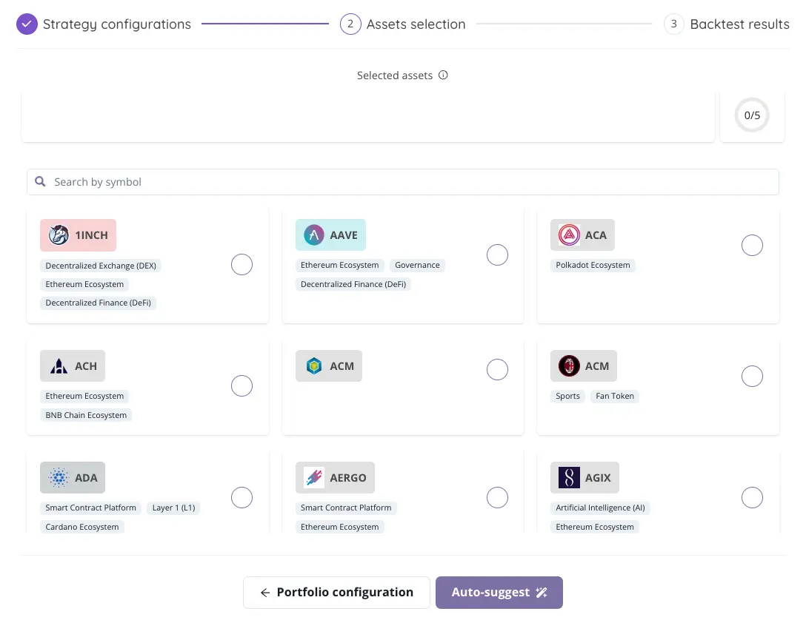

# Step 2 - Assets selection

<figure><figcaption></figcaption></figure>

Here you can see the assets that were selected by the algorithm for your asset pool. You can modify your pool by including or excluding assets, but you must select exactly the amount of assets that you previously chose for your pool. Refer to the purple bar to find your way.

<figure><figcaption></figcaption></figure>

Upon reaching this stage, you're presented with the assets meticulously selected by our algorithm, tailored to fit the parameters and strategies you've previously defined. This moment marks a crucial step in refining your investment approach, where you have the flexibility to adjust the composition of your asset pool to perfectly match your investment vision.

### **Customizing Your Asset Pool**

Adjusting your asset pool is a straightforward process, allowing for the inclusion or exclusion of assets based on your deeper insights or changing preferences. However, it's important to adhere to the number of assets you initially decided to allocate to your pool. Here's how you can effectively manage this process:

1. **Review the Selected Assets:** Take a moment to assess the assets chosen by the algorithm. These selections are based on the criteria and objectives you've set, aimed at optimizing your portfolio's performance.
2. **Including or Excluding Assets:** Should you wish to tailor your asset pool further, you can add assets you find promising or remove those you deem less aligned with your goals. This step ensures your portfolio is truly customized to your preferences.
3. **Adhering to Your Asset Pool Size:** As you make adjustments, keep an eye on the purple bar indicator. This visual guide helps you track the number of assets within your pool, ensuring you select exactly the amount you previously determined for your strategy.

### **Making Informed Adjustments**

* **Strategic Inclusion:** When adding assets, consider how each asset complements your portfolio's diversity and potential for returns. Choose assets that fill gaps or strengthen your portfolio's overall risk-return profile.
* **Thoughtful Exclusion:** Removing assets from your pool should also be a considered decision. Exclude assets that might increase your portfolio's risk unnecessarily or that no longer meet your investment criteria.

### **Finalizing Your Asset Pool**

Once you've fine-tuned your asset pool, aligning it with the exact number of assets you initially set, you've completed a pivotal phase in creating a portfolio that is not only based on advanced algorithmic recommendations but also personalized to your investment insights. This balance between algorithmic precision and personal preference is key to crafting a strategy that aligns closely with your financial goals and risk tolerance.\

<figure><figcaption></figcaption></figure>


