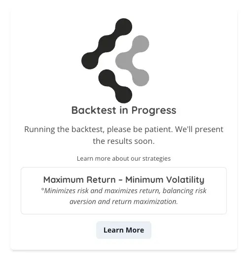
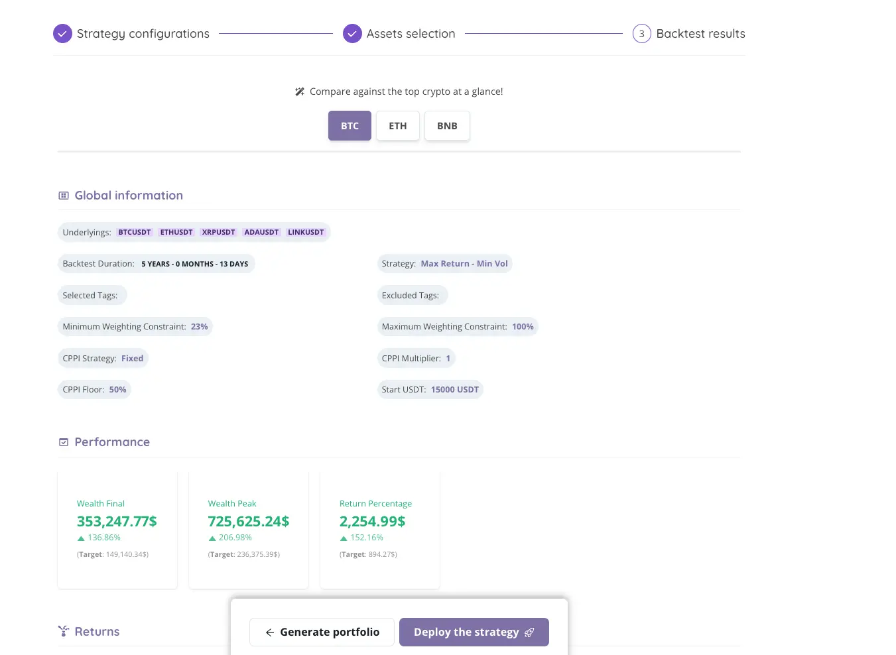

# Step 3 - Backtest & launch

## Understanding the Backtest Process

Once you've confidently selected your asset pool and are ready to validate your strategy through backtesting, the journey from initiation to insight is straightforward yet crucial. Clicking on the "backtest" button sets this process in motion, leading you to a screen that confirms your backtest is actively running.

### **What Happens After Clicking 'Backtest'?**

* **Confirmation Screen:** Immediately after initiating the backtest, you'll be greeted by a screen that serves as a confirmation that your backtest is in progress. This interim screen is your indicator that the system is diligently analyzing your strategy based on historical data.
* **Awaiting Results:** During this phase, the algorithm simulates the performance of your selected assets over the chosen time frame, applying your strategy parameters to provide a comprehensive assessment of potential outcomes.

<figure><figcaption></figcaption></figure>

**Next Steps:**

1. **Patience is Key:** The backtesting process requires a short waiting period while the system processes vast amounts of historical market data. This time allows for a thorough and accurate analysis of how your strategy would have performed.
2. **Results and Insights:** Upon completion of the backtest, the screen will update to display the results, offering you a detailed breakdown of your strategy's historical performance. This includes metrics such as total return, volatility, and the Sharpe ratio, among others.
3. **Detailed Explanation:** Subsequent pages will guide you through interpreting each part of the results page. This step-by-step explanation ensures you can fully understand and leverage the insights gained from backtesting to refine your strategy further.

### **Leveraging Backtest Results**

<figure><figcaption></figcaption></figure>

The backtest results screen is more than just a reflection of past performance; it's a window into the potential future behavior of your investment strategy. By carefully analyzing the outcomes and metrics provided, you can make informed decisions about strategy adjustments, risk management, and asset allocation to optimize your portfolio's performance.

Remember, backtesting is an invaluable tool in the strategic planning process, providing evidence-based insights that can help you build a more resilient and effective investment portfolio.

<figure><figcaption></figcaption></figure>


