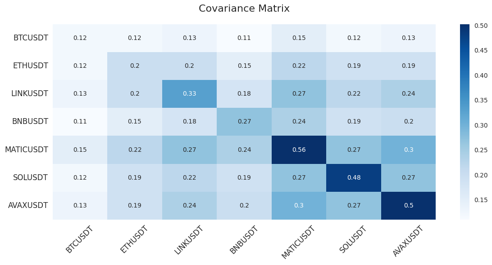

# Covariance Matrix

<figure><figcaption></figcaption></figure>

## Covariance Matrix: A Tool for Strategic Portfolio Diversification

The Covariance Matrix is an indispensable analytical tool in portfolio construction, enabling analysts and investors to quantify the degree to which different assets move in relation to one another. By understanding the covariance between assets, investors can strategically diversify their portfolio to minimize overall risk, enhancing the potential for stable returns.

### **Covariance Significance**

* **Positive Covariance:** Indicates that assets tend to move in the same direction. While this might be favorable in rising markets, it can increase risk during market downturns.
* **Negative Covariance:** Suggests assets move in opposite directions. This diversification can safeguard the portfolio against market volatility, as losses in one asset may be counterbalanced by gains in another.

### **Leveraging the Covariance Matrix for Portfolio Optimization**

* **Strategic Asset Selection:** Utilize the Covariance Matrix to identify assets that complement each other in terms of price movement. Selecting a mix of assets with varying degrees of covariance can create a more resilient portfolio.
* **Diversification Benefits:** A well-constructed portfolio, based on a thorough analysis of covariance among assets, can achieve diversification benefits, spreading risk across assets that behave differently under similar market conditions.
* **Continuous Review:** Given that market dynamics and asset relationships can evolve, continuously reviewing and updating the Covariance Matrix is essential for maintaining an optimized portfolio. Adjustments may be necessary as new information becomes available or as market conditions shift.

### **Implementing Covariance in Investment Strategies**

Understanding and applying the principles of covariance through the Covariance Matrix allows investors to make informed decisions on asset allocation. By considering the statistical measures of how assets interact with each other, investors can construct portfolios that are better equipped to withstand market fluctuations, achieving a balanced approach to risk and return.

Incorporating the Covariance Matrix into your investment strategy is a proactive step towards sophisticated risk management, ensuring that your portfolio is not only diversified but also strategically aligned to minimize risk and capitalize on potential market movements.

<figure><figcaption></figcaption></figure>


