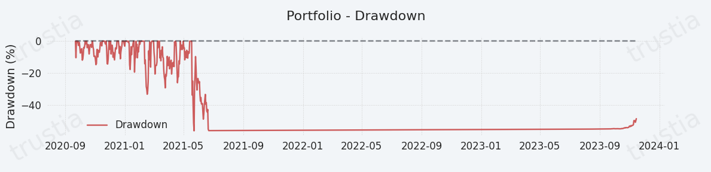

# Drawdown

<figure><figcaption></figcaption></figure>

## Understanding Drawdown in Financial Investments

Drawdown is a critical financial metric that measures the extent of an investment's decline from its all-time high (ATH) to its lowest point before a new peak is established. It is essentially the peak-to-trough decline during a specific record period of an investment, portfolio, or fund. This metric is invaluable for assessing risk exposure, financial resilience, and the potential for volatility within an investment strategy.

### **Significance of Drawdown in Investment Strategy**

* **Risk Exposure:** Drawdown provides investors with a clear picture of potential loss, highlighting the maximum amount an investment has declined over a particular period. This information is crucial for understanding the level of risk associated with an investment.
* **Performance Evaluation:** By measuring the largest single drop from peak to bottom, drawdown helps investors evaluate the performance and stability of their investments. A significant drawdown indicates higher volatility and risk, whereas a smaller drawdown suggests a more stable investment.
* **Investment Decision-Making:** Understanding drawdown can influence investment decisions, particularly in terms of risk management and portfolio diversification. Investors may seek to minimize drawdowns by diversifying their investments across various asset classes or by implementing strategies designed to protect against large losses.

### **How to Calculate and Interpret Drawdown**

1. **Identify the All-Time High (ATH):** Determine the highest value reached by the investment during the specified period.
2. **Measure the Subsequent Lowest Point:** Find the lowest value after the ATH before a new peak is established.
3. **Calculate the Drawdown:** The drawdown is the difference between the ATH and the lowest point, usually expressed as a percentage. A larger percentage indicates a more significant decline, highlighting greater risk and potential volatility.

Drawdown is an essential metric for investors aiming to understand and manage the risks associated with their investment portfolios. By carefully analyzing drawdowns and implementing strategies to mitigate their impact, investors can enhance the resilience of their investments, better manage volatility, and work towards achieving more stable returns.


[🔗 Learn more about Drawdown ](../../../../risk-management-framework/risk-measures/maximum-drawdown.md)


<figure><figcaption></figcaption></figure>



##
