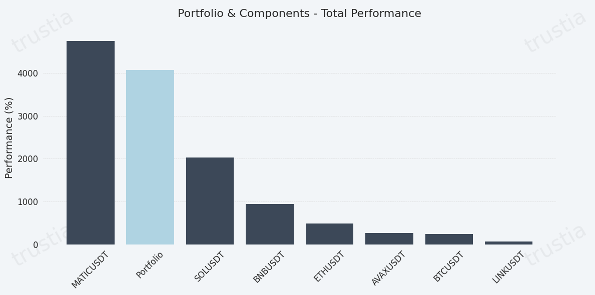
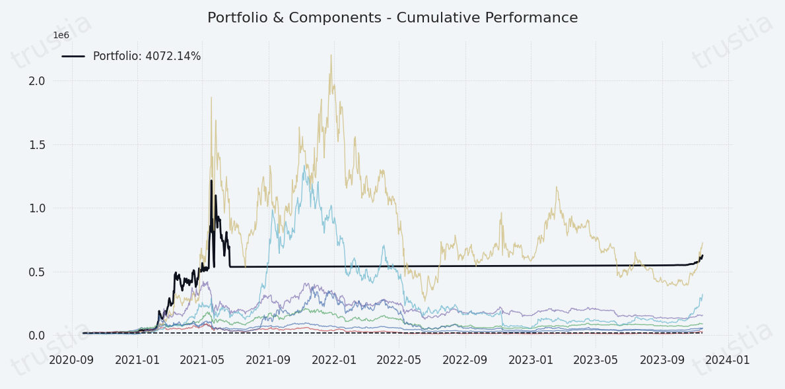

# Portfolio Performance

<figure><figcaption></figcaption></figure>

<figure><figcaption></figcaption></figure>

## Portfolio Performance: A Comprehensive Analysis

Understanding the performance of your portfolio in relation to the individual assets that compose it is essential for fine-tuning your investment strategy and achieving optimal returns. With our Portfolio Performance analysis feature, you gain in-depth insights into how each asset contributes to the overall performance of your portfolio, enabling strategic adjustments for enhanced outcomes.

### **Key Benefits of Portfolio Performance Analysis**

* **Individual Asset Insight:** Gain a clear view of each asset's performance within your portfolio. This detailed analysis allows you to identify which assets are driving performance and which may be lagging, offering opportunities for reallocation or divestment.
* **Strategic Optimization:** By understanding the individual contributions of each asset, you can make informed decisions to rebalance your portfolio, ensuring it aligns with your investment goals and risk tolerance.
* **Performance Comparison:** Compare the performance of individual assets against the portfolio as a whole. This comparison helps in assessing the diversification effectiveness and identifying areas for improvement.

### **How to Leverage Portfolio Performance Analysis**

1. **Review Individual Performance:** Start by examining the performance metrics of each asset, including returns, volatility, and any relevant ratios such as Sharpe or Sortino. This initial step provides a foundation for deeper analysis.
2. **Evaluate Against Portfolio Performance:** Assess how each asset's performance contributes to the overall portfolio. Consider factors such as correlation, risk contribution, and return on investment to understand the role each asset plays.
3. **Identify Opportunities for Adjustment:** Use the insights gained to identify potential adjustments. This may involve increasing exposure to high-performing assets, reducing holdings in underperforming assets, or introducing new assets to improve diversification and risk-adjusted returns.
4. **Implement Strategic Changes:** Armed with a comprehensive understanding of your portfolio's performance dynamics, make the necessary adjustments to your asset allocation. Continuously monitor and analyze performance to ensure your portfolio remains optimized for your objectives.

### **Empowering Your Investment Strategy**

The Portfolio Performance analysis feature is designed to empower investors with the knowledge needed to make strategic decisions. By offering a granular view of how individual assets impact the overall portfolio, investors are equipped to refine their strategies, ultimately leading to more informed investment choices and the potential for improved returns.

Embrace the depth of insight provided by Portfolio Performance analysis to navigate the complexities of the financial markets more effectively, ensuring your investment strategy is both robust and responsive to changing market conditions.

<figure><figcaption></figcaption></figure>


