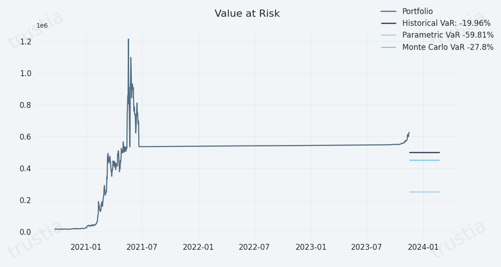

# Values at Risk

<figure><figcaption></figcaption></figure>

## Navigating Risk with Value at Risk (VaR)

Value at Risk (VaR) stands as a cornerstone in the field of risk management, offering a quantifiable estimate of the maximum potential loss an investment, portfolio, or position might face over a specified period, within a certain confidence level. VaR has become an essential tool for risk managers seeking to quantify and control the risk exposure of assets, enabling the strategic management of financial uncertainties.

### **Key Aspects of Value at Risk**

* **Risk Quantification:** VaR provides a clear metric for the potential loss in value of a risk-bearing asset or portfolio, aiding in the assessment and management of risk.
* **Confidence Interval:** The confidence level associated with VaR  indicates the probability that the potential financial loss will not exceed the VaR estimate within the given time frame.
* **Time Period:** VaR assessments consider a specific period, allowing for the evaluation of short-term and long-term risk exposures.

Value at Risk (VaR) provides a critical framework for understanding and managing the financial risks associated with investment activities. By applying appropriate VaR calculation methods, organizations can enhance their risk management strategies, making informed decisions that balance the pursuit of returns with the imperative of risk control.


[🔗 Learn more about Value at Risk](../../../../risk-management-framework/value-at-risk/)


<figure><figcaption></figcaption></figure>


