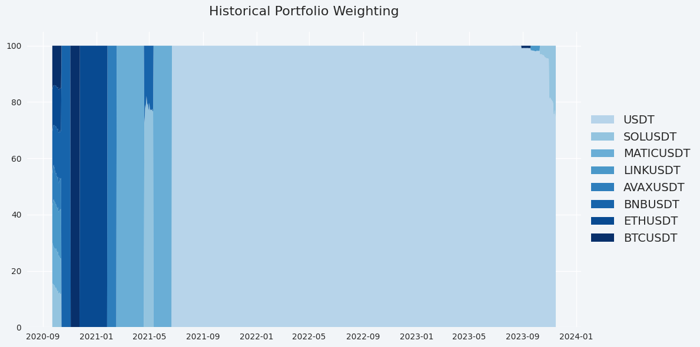

# Weightings

<figure><figcaption></figcaption></figure>

## Historical Portfolio Weighting: A Visual Chronicle of Rebalancing

The Historical Portfolio Weighting feature offers investors a vivid look back at the rebalancing history of their portfolio. Through color-coded charts, each asset is represented by a distinct color, corresponding to its symbol, allowing for an intuitive and visual understanding of how asset allocations have shifted over various periods. This visual tool is indispensable for investors seeking to analyze the strategic adjustments made to their portfolio over time.

### **Benefits of Historical Portfolio Weighting Analysis**

* **Strategic Insights:** Reviewing the rebalancing history helps investors understand the timing and impact of their decisions, shedding light on strategic moves that contributed to the portfolio's performance.
* **Trend Identification:** By visualizing the historical weighting of assets, investors can identify trends and patterns in their allocation strategy, such as a tendency to favor certain asset classes over others.
* **Performance Correlation:** Understanding past rebalancing actions in the context of market conditions allows investors to correlate these moves with portfolio performance, offering lessons for future strategy adjustments.

### **Navigating the Historical Portfolio Weighting Chart**

* **Color Association:** Each asset in the portfolio is associated with a specific color, making it easy to track its presence and proportion over time.
* **Chart Interpretation:** The chart segments represent different periods, allowing investors to observe how the composition of their portfolio has evolved, highlighting periods of significant rebalancing.

<figure><figcaption></figcaption></figure>

### Current Assets Weighting: Your Portfolio's Present Composition

In addition to historical analysis, the Current Assets Weighting feature provides a snapshot of your portfolio's current asset allocation. Similar to the historical chart, this visualization uses color codes associated with each asset's symbol to depict the present composition of your portfolio. This real-time insight is crucial for ensuring that your current investment strategy aligns with your financial goals and risk tolerance.

### **Leveraging Current Assets Weighting for Strategic Advantage**

* **Immediate Overview:** Gain an instant understanding of your portfolio's current diversification and asset distribution, enabling quick assessments of balance and risk exposure.
* **Strategic Adjustments:** The current allocation visualization aids in identifying overconcentration or underrepresentation of certain assets, guiding immediate rebalancing decisions if necessary.
* **Goal Alignment:** Ensure that your portfolio's current composition reflects your strategic investment objectives, whether you're focused on growth, income, stability, or a combination of these goals.

<figure><figcaption></figcaption></figure>


